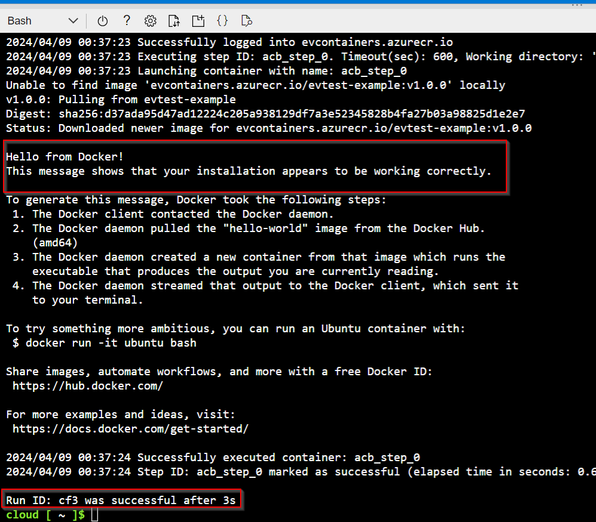

# Build and Run a Container Using Azure ACR Tasks

**There are 4 objectives with this lab:**
* Start Cloud Shell
* Create a New Container Registry
* Build an Image and Push to ACR
* Run the New Container

## Start Cloud Shell

I want to start this lab off by saying I didn't know how to do this lab at all so I resorted to watching the walkthrough and go through the text guide. All the commands are sourced from the walkthrough but I chose to modify them and explain each part of the command so show full understanding of whats happening. So with that being said, lets start this lab!

In the first part of the lab, we'll need to get the Azure Cloud Shell up and running. We've done this plenty of times so no walkthrough here. Use Bash and make sure the location matches the location of the storage account in your resource group (RG) though. 

Once your Cloud Shell is up,  that completes the first objective of this lab! On to objective 2. 

## Create a New Container Registry

For the second portion of this lab, we're going to the container registry using Azure Cloud Registry (ACR). So the first thing I did was create a variable for both my resource group and the name of my container registry since we'll need to refer to these values in the following commands. It's only three commands but this just makes it easier to not make mistakes. 

Once that's completed, we'll use the following command to create the ACR. The ACR is where we'll store the containers. Think of it as a warehouse where we can put boxes (or literal containers). We can call upon it to find a repository or container. We're just choosing to store it here. The command is: `az acr create --resource-group $RG --name $ACR --sku Basic --admin-enabled true`. Lets break this down:

The `az acr create` command creates the ACR. Pretty straightforward. The only arguments you need are the RG, name, and SKU. You don't need the `--admin-enabled true` argument but at the same time, you do. The RG and name are pretty self explanatory as well. We have to give our ACR a name. That's why I created the name variable first. We need to choose a SKU which enables certain ACR features. I believe the options are Basic, Standarda and Premium. You can learn more about the `az acr create` command on the Microsoft Azure website ([link here](https://learn.microsoft.com/en-us/cli/azure/acr?view=azure-cli-latest#az-acr-create))

The `--admin-enabled true` allows us to manage and make changes to the ACR without needing authentication credentials or needing to use a service principal (see my Service Principal's lab for more on that method). We never created any authentication credentials so I was told if we just tried to create the ACR without the `--admin-enabled true` command, it wouldn't even allow us to create it. Think of this argument as `sudo` for Linux. 

That pretty much explains each part of the command. Putting that in Bash looks something like this:

If you go to your All Resources page, the container should populate. 

That completes the second objective. Lets move to the 3rd one. 

## Build an Image and Push to ACR

Now, we have to build the custom image and push it to the ACR. First thing we need to do is go to the `clouddrive` directory in the Azure Cloud Shell. Why do we have to go here? I'm not exactly sure but here's some more background on this directory:

The `clouddrive` directory is created any time you make  Bash or PowerShell session in the Azure Cloud Shell. I've been incorrectly referring to it as the Azure CLI but the Azure Cloud Shell creates a web-based, shell environment where you can interact with the core of Azure. You can use the Azure CLI, Bash or PowerShell to do this. The Azure CLI is actually the commands you use to do that that are specific to Azure. `az vm create` and `az acr build` are Azure CLI commands. You can do the same thing in PowerShell (PS) using commands (or cmdlets) such as `New-AzVM` but those are specific to PowerShell. Hopefully that makes sense. But back to `clouddrive`. This is a directory that is persistent across all Azure Cloud Shell sessions. I'm not entirely sure what that means but just know that file will be created. This is where we'll store our Docker file. 

Navigate to the file by using `cd clouddrive` which should get you to `home/cloud/clouddrive`. You can use the `ls` to see any directories in your current directory. You can also use `pwd` (print working directory) to see the directory you're in and the path to it.

Once here, we'll create our Docker file. We're going to use the command `echo "FROM hello-world" > EVfirstdockerfile` to create our Docker file. Lets break that down:

I'll assume you already know what `echo` and `>` does. Lets focus on "FROM hello-world". You don't really need the quotation marks I believe but the "FROM hello-world" is an instruct that will be in our Docker file that says "get the image "hello-world" FROM the Docker ecosystem". The Docker ecosystem has a bunch of images in it's ecosystem (I can't tell you where that's located) but Azure knows where to find the Docker ecosystem and the ecosystem gives it the image its asking for. You can also upload custom images to the ecoystem. I don't know how but that is how all of this works and why it's efficient. 

The "EVfirstdockerfile" is just a plain text file with the said name. That is all Docker files are. They are plain text files (like a Notepad file .txt) with instructions that Docker understands such as COPY, REMOVE, FROM, etc. Its simple right?

So that commad will create the Docker file. You can see it in your directory and see the contents of the file using the Linux command `cat`. I'm also going to create a variable for my Docker file so I don't mess up the name. The variable will be `$DF`.

Now that the Docker file is created, lets create the container in the ACR using the command `az acr build --image evtest-example:v1.0.0 --registry $ACR --file $DF /home/cloud/clouddrive`. Lets break that down:

The `az acr build` command builds the container. Pretty straight forward. The `--image evtest-example:v1.0.0` creates the name of the container. This is arbitrarily chosen by us. We can name our container whatever we want to name it. I chose to name mine `evtest-example`. The `:v1.0.0` is a tag. It's basically like a versioning system. You can give it a tag so you know exactly which container version you're using just in case you decide to make different versions or iterations of the container. That's also arbitrarily chosen by us. 

`--registry $ACR` tells the command which ACR the container will go to. The `--file $DF` tells the command what Docker file will be used to create this custom container. All of the directions to create the container are in this file. We created this file earlier. This is where the command will know to pull the "hello-world" image from the Docker ecosystem. The file path at the end tells the command where the source file will be. We can also replace that entire path with simply a dot `.` to indicate "this" is the source. 

Here are the commands in the Bash shell:

You can go to your ACR in the portal and then on the lefthand side, go to Services > Repositories. You should see your repository and the tag associated with it as well. 

Now we're done with Objective 3. Lets move on to the final objective. 

## Run the New Container

Now, lets actually run the repository that we built. We'll use the command `az acr run --registry $ACR --cmd '$Registry/evtest-example:v1.0.0' /dev/null` to do that and per usual, lets break it down:

The `az acr run` command runs the repository that we created. It takes the image that was built on the Docker file we create and goes through the Docker instructions. The `--registry $ACR` tells the run command where the container is located. The `--cmd '$Registry/evtest-example:v1.0.0'` argument tells the command will which repository to run and where its located. I guess Azure just automatically knows what to fill in for `$Registry`. The explanation Chat GPT gave  me wasn't the best. 

The `/dev/null` part is just a best practice when running repositories. It basically tells the command to expect no input for any part of the run process that would expect and input but an input was not stated in the command. Its so the run command doesn't get hung up on some random command process that would need an input but doesn't have it. Basically it kind of forces the command to run regardless of if it has the necessary information or not. Google it for more information. That's my current understanding of it. 

That command should look like this in the Bash environment:

Now, the "hello-world" image is a beginner test image to make sure your Docker commands are working. You should get a message to confirm this. It will look like the following:

Lab completed!

## Personal Notes

Definitely the least understood lab of this course but it's making me want to take a Docker course so I can understand things in more detail. This was fun and forced me to ask Chat GPT a ton of questions to lear more about these three Docker/ACR commands and more about Service Principals. I also learned some more information on the format of Docker files, Linux commands, and which parts of these commands were arbitray to me. There was still a little confusion on why ACR accepted `sample/hello-world:v1` for the lab's --image argument but it wouldn't allow me to put `RockstarEV/test-example:v1.0.0` for mine. It wasn't accepting my registry. Maybe someone can break this down for me. 

Anyway, fun lab once I learned what everything meant!
